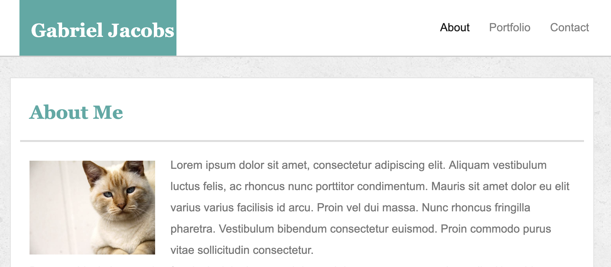

# UpdatedPortfolio

* Check out my portfolio! This website consists of an about-me, a contact, and a portfolio page. The about-me page portrays information cleanly and concisely. The contact page offers my contact information. The portfolio page dispays a gallery of works. This site utilizes the bootstrap framework in order to effectively style/layout each of the pages contents. 

[Click here to check out the site!](https://gljacobs.github.io/Updated-Portfolio/)

<!--  -->

## Technologies used:
* HTML 
* CSS
* Bootstrap
 
 ## Author: Gabriel Jacobs
